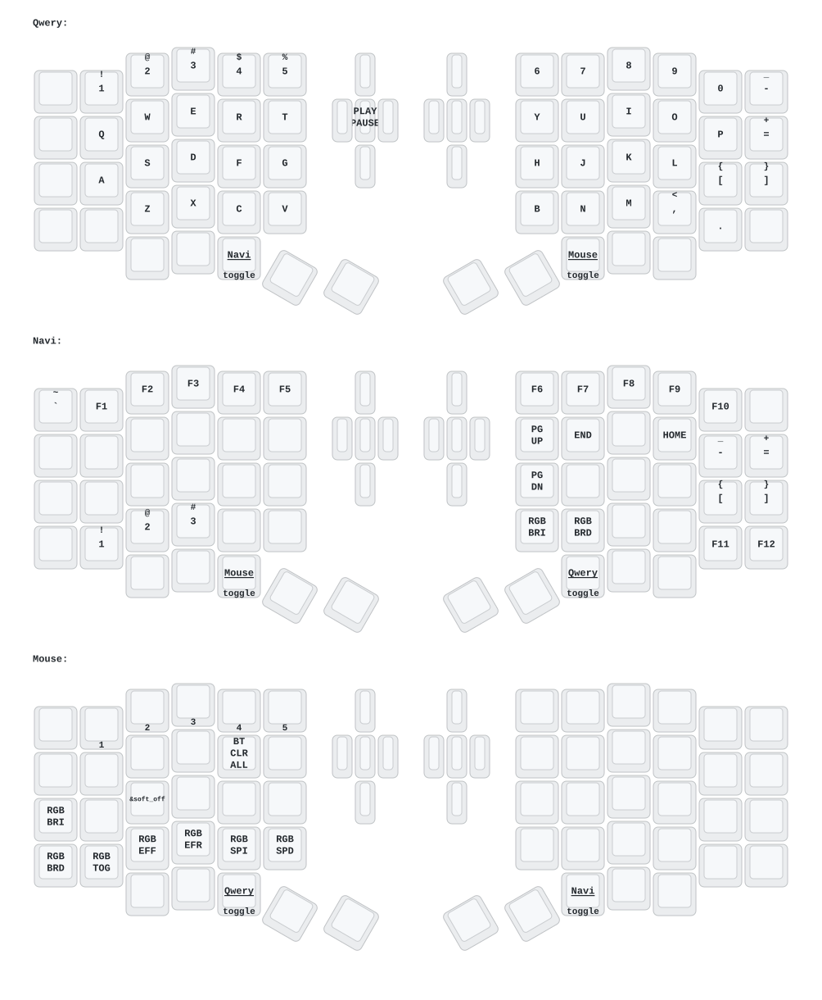

# zmk-config-sofle




# 本地编译

```bash
cd zmk-sofle
mkdir modules;cd modules
git clone https://github.com/GPeye/hammerbeam-slideshow.git

python3 -m venv .venv
source .venv/bin/activate
cd ./app

ZMK_SOFL_DIR="$(realpath ../zmk-sofle)"
EXTRA_MODULES="$ZMK_SOFL_DIR;$ZMK_SOFL_DIR/modules/hammerbeam-slideshow;$ZMK_SOFL_DIR/modules/zmk-a320-driver"

#left_studio
west build -p -d $ZMK_SOFL_DIR/build/left_studio -b sofle_left -S studio-rpc-usb-uart -- -DSHIELD=nice_view \
-DCONFIG_ZMK_STUDIO=y -DCONFIG_ZMK_STUDIO_LOCKING=n \
-DZMK_EXTRA_MODULES="$EXTRA_MODULES"

#right
west build -p -d $ZMK_SOFL_DIR/build/right -b sofle_right -- -DSHIELD=nice_view_custom \
-DZMK_EXTRA_MODULES="$EXTRA_MODULES"
```